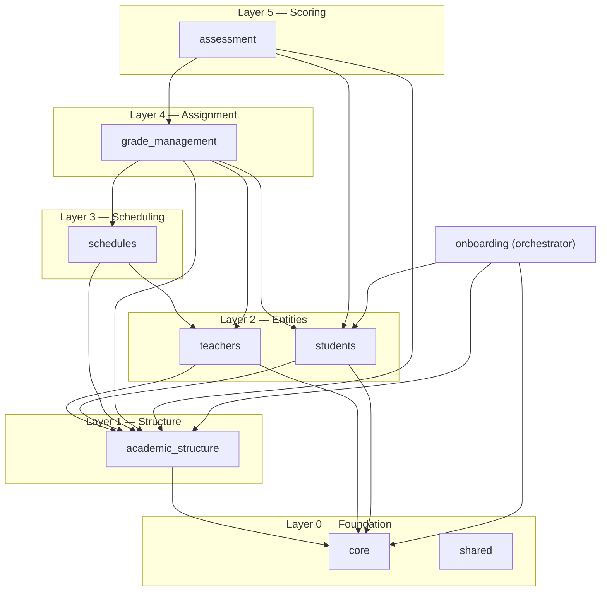
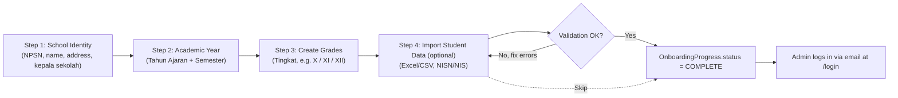

# Architecture & Design Pattern — Edu-Sys

## 1. Overview

This document defines the architecture conventions for the School Management System (Edu-Sys): a **modular monolith**, deployed **single-tenant per school** (one Django process + one Postgres database per customer). This system prefers separate Django apps as bounded contexts, a service/selector layer for cross-app access, structlog for logging — adapted for this app's different deployment model and domain.

This system has **no tenant concept at all**. Every deployed instance belongs to exactly one school.

## 2. Deployment Model

- One Docker-composed stack (Django + Postgres + Redis + Celery worker/beat) per school.
- No shared database, no `tenant_id` columns, no cross-school queries — ever.
- The codebase is identical across every deployment; only the database contents differ. New school = new stack from the same image, not new code.

## 3. Architectural Style: Modular Monolith

Each domain lives in its own Django app. Apps never reach into another app's models directly — all cross-app access goes through that app's **service/selector layer** (plain functions, not classes).

**On "modules depending on each other":** dependencies exist between modules, but they are not circular. Modules are arranged in layers; a module may depend on anything in a layer below it, never on a layer above it. The rule isn't "no dependencies," it's "dependencies only flow one direction."

(Arrow = "depends on." `assessment` sits at the very top: it depends on `grade_management` to check which teacher is actually authorized to score which grade+subject, and on `students` for who's being scored. Nothing depends back on it. `grade_management` also depends on `students` now — see Section 6 on why.)

## 4. Module Breakdown

### `core` (Layer 0 — foundation, depends on nothing)
- **Responsibility:** school identity, academic year/semester, the Admin user model, roles/permissions, audit log, and personnel profiles for non-domain roles.
- **Key models:** `School` (NPSN, NSS, name, address, level SD/SMP/SMA/SMK, kepala sekolah, logo), `AcademicYear` (label e.g. "2025/2026", semester GANJIL/GENAP, `is_active`), `User` (email-based, no username), `AuditLog`, `PersonnelProfile` (staff, nurse, librarian, security, etc.).
- **Exposes:** `get_active_academic_year()`, `get_school_profile()`, user provisioning functions.

> **On `PersonnelProfile` vs. domain models:** A role like Nurse, Librarian, or Security has no rich domain data beyond contact info and role type — they don't need a separate Django app. `PersonnelProfile` (one model in `core`) handles these as a `TextChoices` enum. Promote a role to its own Django app only when it develops genuine domain complexity (e.g., Nurse needs medical certificates, Librarian needs book inventory). See `docs/data-model.md` for the schema.

### `academic_structure` (Layer 1, depends on `core`)
- **Responsibility:** grade levels (Tingkat), majors, subjects, and class sections — the structural data everything else attaches to. This is also where Grade *creation* happens (onboarding's "Create Grades" step, and later ad hoc additions) — as distinct from Grade *Management* (Layer 4), which is the assignment menu, not the CRUD.
- **Key models:** `GradeLevel` (Tingkat — e.g. "X"/"XI"/"XII" or "1".."6"), `Major` (Jurusan/Peminatan, optional), `Subject` (Mata Pelajaran), `ClassSection` (Kelas — e.g. "X IPA 1", FK to grade level + academic year + homeroom teacher). `ClassSection` is what the "Class Management" feature manages.
- **Exposes:** `create_grade_level()`, `create_class_section()`, `list_grade_levels()`, `list_class_sections_for_year()`.

### `teachers` (Layer 2, depends on `core`, `academic_structure`)
- **Responsibility:** teacher profiles only. The *assignment* half of "Teacher Management and Assignment" is owned by `grade_management` (Layer 4) — this app can expose a read-only view of a teacher's current assignments by calling into `grade_management`'s selectors, but doesn't own that data.
- **Key models:** `Teacher` (NUPTK, name, employment status PNS/Honorer/GTY, contact).
- **Exposes:** `create_teacher()`, `get_teacher_profile()`.

### `students` (Layer 2, depends on `core`, `academic_structure`)
- **Responsibility:** student profiles, enrollment into a class section, bulk import.
- **Key models:** `Student` (NISN, NIS, name, DOB, gender, phone number, email, guardian contact), `Enrollment` (student × class section × academic year × status), `ImportBatch` (tracks a bulk-import run and its validation errors). #For phone number & contact, add an additional checkbox if the phone number is the same as guardian (in case this for a Grade School)
- **Exposes:** `enroll_student()`, `bulk_import_students(file)`, `get_roster(class_section)`.

### `schedules` (Layer 3, depends on `academic_structure`, `teachers`)
- **Responsibility:** the raw scheduling infrastructure — time slots and conflict detection. This app answers "is this teacher/slot free?"; it doesn't decide *what* gets scheduled — that's `grade_management`.
- **Key models:** `TimeSlot` (day + period).
- **Exposes:** `is_slot_available(teacher, time_slot)`, `list_time_slots()`. #Can I use Google Calendar API with customized view for this?

### `grade_management` (Layer 4 — depends on `academic_structure`, `teachers`, `schedules`, `students`)
- **Responsibility:** this is the actual "Grade Management" feature/menu — for a given Grade Level (Tingkat), the Admin assigns a Teacher, a Subject, and a Schedule slot. It's also where students get added if the onboarding import step was skipped (see Section 6): the menu calls straight into `students.enroll_student()` / `bulk_import_students()` — it doesn't own that data, just surfaces the action for a grade that has none yet.
- **Key models:** `GradeAssignment` (grade level × subject × teacher × time slot × academic year) — calls `schedules.is_slot_available()` before saving to prevent double-booking.
- **Exposes:** `assign_teacher_to_grade(grade_level, subject, teacher, time_slot)`, `list_assignments_for_grade(grade_level)`, `list_assignments_for_teacher(teacher)` (this last one is what `teachers` calls to show a teacher's load without owning the data itself).

### `assessment` (Layer 5 — depends on `students`, `academic_structure`, `grade_management`)
- **Responsibility:** the separate menu for recording student marks (Nilai) and generating report cards, as you specified — kept fully apart from `grade_management`. `grade_management` decides *who teaches what*; `assessment` records *what they scored*.
- **Key models:** `AssessmentComponent` (Tugas/UH/UTS/UAS, with weight), `Score` (student × subject × component × semester × value — a save is only valid if a matching `GradeAssignment` exists, so a teacher can't score a subject/grade they aren't assigned to), `ReportCard` (a generated per-student, per-semester snapshot).
- **Exposes:** `record_score()`, `compute_semester_average()`, `generate_report_card(student, semester)`.

### `onboarding` (orchestrator — depends on `core`, `academic_structure`, `students`)
- **Responsibility:** the first-run setup wizard. Owns no domain data of its own beyond a progress marker — it sequences calls into the other modules' service functions and tracks completion. Gates Admin login (see Section 6). Note it stops at *creating* Grade Levels — the Teacher/Subject/Schedule assignment (`grade_management`) and score recording (`assessment`) are post-onboarding, ongoing dashboard activities, not part of first-run setup.
- **Key models:** `OnboardingProgress` (current step, completed timestamp).
- **Exposes:** `get_onboarding_status()`, `advance_step()`, `complete_onboarding()`.

### `shared` (Layer 0 — foundation, depends on nothing)
- **Responsibility:** cross-cutting utilities used by every other app — base model mixins (timestamps, soft delete), Excel/report generation helpers, notification dispatch, service/selector base classes, structlog PII-redaction processors.

## 5. Terminology

"Grade" has one meaning throughout this system: Tingkat/Kelas (grade level), never a score or mark. **Grade Management** is the assignment menu — Tingkat ↔ Teacher ↔ Subject ↔ Schedule — owned by `grade_management`. **Class Management** is the Kelas (class section) CRUD, owned by `academic_structure`. **Assessment** is the separate menu that records marks (Nilai) — its own module, never merged into `grade_management`. Keep these three separate in the UI and in code even though the first two both ultimately touch `GradeLevel`.

## 6. Onboarding Flow

A fresh deployment has an empty database and **no usable Admin login** until onboarding completes. The wizard runs before authentication is fully active — the Admin account itself is created as part of the wizard, not before it.

Gate logic: any request to `/login` or the dashboard checks `OnboardingProgress.status`. If it isn't `COMPLETE`, the request is redirected to `/onboarding` at whichever step is next.

Note: Teacher/Subject/Schedule assignment (`grade_management`) and score recording (`assessment`) both happen *after* onboarding, from the dashboard — onboarding only creates the Tingkat records themselves, since teachers, subjects, and marks don't exist yet at first setup.

Step 4 is optional — an admin can skip straight to completion without importing any students. If skipped, `OnboardingProgress` still flips to `COMPLETE` and Admin login unlocks as normal; student data just gets added later from the **Grade Management** menu instead, per-grade, rather than as one bulk onboarding step.

## 7. Authentication & Authorization

- **Admin login is email-based** — no username field on `User`.
- API auth uses `djangorestframework-simplejwt` (already in your deps) — this is what the dashboard's own frontend calls, and it's the same surface a future mobile app would authenticate against.
- **Roles today:** Headmaster & Admin (full access). One open question `assessment` now makes concrete: do Teachers get their own login to record scores directly, or does Admin/staff enter all marks on teachers' behalf? That decides whether `core.User` needs a Teacher-linked role now rather than later — worth settling before you build the Assessment screens. #Teachers also got their own login, by using email & password which needs to be inputted first by Headmaster or Admin. 
- **Roles later:** Parent/Student read-only portal, once the mobile app (Section 10) exists.

## 8. Cross-Cutting Concerns

- **Logging:** structlog, same PII-redaction discipline as Nexus — but the sensitive fields here are different and arguably more sensitive, since most student records belong to minors. NISN/NIS, guardian contact info, date of birth, and Score values should never appear in plaintext logs.
- **Background jobs:** Celery + Redis for anything that shouldn't block a request — bulk student import processing, report card Excel generation, notification dispatch.
- **Excel/report generation:** lives in `shared` as a reusable helper, called by `assessment.generate_report_card()` and callable by any other module that needs it.

## 9. Example Walkthrough — Fictional Indonesian School

**SMA Nusantara Bangsa**, a private senior high school in East Java, receives a fresh deployment:

1. **School Identity:** NPSN `20xxxxxx`, address in Surabaya, Kepala Sekolah's name, school level `SMA`.
2. **Academic Year:** `2025/2026`, Semester Ganjil, marked active.
3. **Create Grades:** Tingkat X, XI, XII created (Jurusan IPA/IPS optionally attached at XI/XII).
4. **Import Student Data (optional):** the admin can upload an Excel sheet of ~300 students (NISN, NIS, name, gender, DOB, target Kelas) right here — the import validates NISN uniqueness and required fields, reports errors inline, and only commits once the admin confirms — **or skip this step entirely** and handle it later.
5. `OnboardingProgress.status` flips to `COMPLETE` either way. The Admin logs in at `/login`.
6. **Post-onboarding, from the dashboard:** admin creates ClassSections (`X IPA 1`, `X IPA 2`, ...) via Class Management, adds Teacher profiles via Teacher Management, then goes to **Grade Management** and assigns, for Tingkat X: Teacher Budi → Subject Matematika → Tuesday period 3. The system checks Budi isn't already booked at that slot before saving. If the school skipped student import during onboarding, this is also where they'd add students to Tingkat X now — same underlying `students` functions, just triggered from Grade Management instead of the wizard.
7. **Mid-semester:** marks are recorded through **Assessment** — a Score for a Tingkat X student in Matematika is only accepted because Budi's `GradeAssignment` for Tingkat X + Matematika exists. At semester end, `generate_report_card()` produces each student's rapor.

## 10. Future Improvements

- **Mobile app** (Android/iOS) for parents and students — read-only grades, schedule, and attendance, built on the existing DRF + simplejwt API surface rather than a new backend.
- **Attendance module** — would slot in at Layer 3 alongside `schedules`, depending on `students` and `academic_structure`.
- **Teacher payroll** - Payroll System for Teacher
- **SPP/payment tracking** — likely its own module, kept separate from `grade_management` and `assessment` since billing has no reason to be coupled to either.
- **Multi-tenant conversion** — only revisit if this product moves from single-school deployments to a sellable-to-many product with real pipeline. Not a near-term concern.
